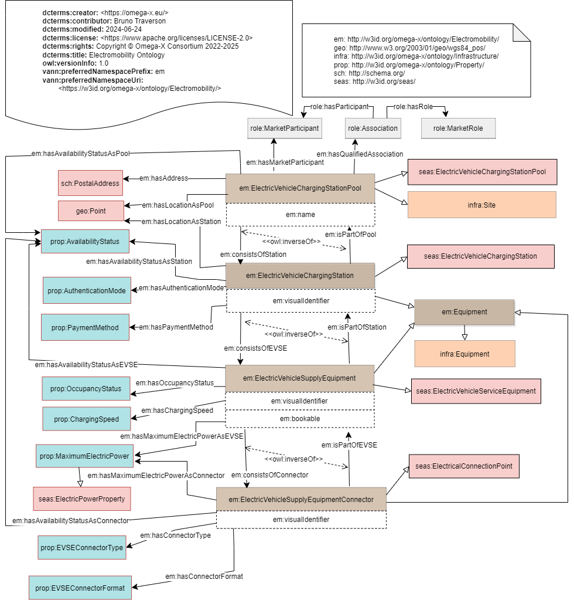

# Electromobility Ontology

## Description
### Purpose
The Electromobility ontology represents and organizes knowledge about the charging infrastructure for electric vehicles. 
### Scope
This ontology defines concepts and relations that are relevant to the charging infractrure - such as pool, station, charging point and connector- but do not cover electric vehicle characteritics. 
Roles of stakeholders of the charging infrastructure are further described in the ROLE ontology. Detailed characteristics of charging equipments and sites are given in the PROPERTY module.
Booking a charging point requires some knowledge on charging infrastructure, like location of the charging station pools, connector types available on a charging point...  
Electromobility ontology provides OWL classes and properties to allow charging infrastructure to be described. The use of a charging infrastructure description facilitates the mutual understanding of electromobility players.
### Contents
This Electromobility Ontology contains four main classes:
- Electric Vehicle Charging Station Pool
- Electric Vehicle Charging Station
- Electric Vehicle Supply Equipment (EVSE)
- Electric Vehicle Supply Equipment  Connector

## Competency Questions
 
### Querying Questions
| ID | Question in natural language | Example
|---|---|---|
| cq-1 | Get the list of electric vehicle charging station pools with their localisation. |
| cq-3 | Get the list of all the electric vehicle charging station pools provided by "TEVGO". |

### Inference Questions
| ID | Question in natural language | Example
|---|---|---|
| cq-2 | Get the list of all the equipments of the electric vehicle charging station pool labelled "Belib/BPX-0104". |

## Glossary

* Electric Vehicle Charging Station Pool: (source eMIP) A Charging Pool is a location where charging infrastructure elements can be found. A Charging Pool may contain several Charging Stations.
* Electric Vehicle Charging Station: (source eMIP) A Charging Station is a physical element, visible for the users, on which Charging Points are available. The Charging Station is also the “Human-Machine Interface” (HMI) between the charge infrastructure and the end users.
* Electric Vehicle Supply Equipment (EVSE): (source eMIP) A Charging Point, synonym of EVSE (Electric Vehicle Supply Equipment), is the energy supply element. An electrical vehicle can connect to a point on one of its connector. A Charging Point may have several Charging Connectors but only one vehicle could be charged at a time on a Charging Point.
* Electric Vehicle Supply Equipment (EVSE) Connector: (source eMIP) A Connector related to an Electric Vehicle Supply Equipment (EVSE) that connects to the electric vehicle for the purpose of charging. It is an interface to deliver electricity.
 
## OWL Description

## Recommendations

- A qualified association should be used to assign the role played by a Stakaholder with regards to an electric vehicle charging station pool (see ROLE ontology).
- When the property is static (never changes of value in time), its value should be contained in an individual of Property class (see PROP ontology).
- When the property is dynamic (frequently changes of value in time), its value should be contained in an individual of ValueSet class (see ETS ontology).

## See also

### SEAS 1.0

* [**_seas:ElectricVehicleChargingStationPool_**](https://w3id.org/seas/ElectricVehicleOntology-1.0): The class of electric vehicle charging station pools. An electric vehicle charging station pool is connected to the grid and composed of one or more electric vehicle charging stations.

* [**_seas:ElectricVehicleChargingStation_**](https://w3id.org/seas/ElectricVehicleOntology-1.0): The class of Charging Stations. An electric vehicle charging station is usually connected to the grid and composed of one or more electric vehicle service equipments.

* [**_seas:ElectricVehicleServiceEquipment_**](https://w3id.org/seas/ElectricVehicleOntology-1.0): The class of Electric Vehicle Service Equipments.

* [**_seas:ElectricalConnectionPoint_**](https://w3id.org/seas/ElectricPowerSystemOntology-1.0): The class of electrical connection points of electric power systems, at which they may be electricaly connected to other systems. For example, an electric vehicle service equipment may have three electric power connection points: two different kinds of plugs that enable to charge electric vehicles, and a three-phase power bus connection point to the grid.

### UIOTE 1.0.1

* [**_uiote:ChargingStation_**](http://www.w3id.org/urban-iot/electric): Place where it is possible to recharge vehicles, that includes both Electric Vehicle Supply Equipments (EVSE) and the parking areas to allow the vehicle stop during the charging activity.

* [**_uiote:EVSE_**](http://www.w3id.org/urban-iot/electric): Electric Vehicle Supply Equipment (EVSE) available for charging vehicles.

* [**_uiote:Connector_**](http://www.w3id.org/urban-iot/electric): Connector related to an Electric Vehicle Supply Equipment (EVSE).