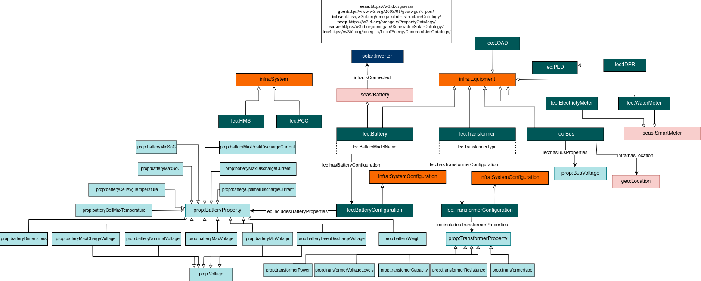

# Local Energy Communities Ontology

## Description
### Purpose
Optimizing self consuption, losses detection and gamification for eletric saving requires some knoweldge on LEC equipments.
### Scope
Local energy communities ontology provides OWL classes and properties to allow local energy equipments and their static parameters to be described.
### Description
This Local Energy Communities ontology helps to define the equipments of OMEGA-X Local energy communities use cases. It includes the battery, transformer, bus, smart meter and Intelligent Distribution Power Router. 

## Competency Questions

### Querying Questions
| ID | Question in natural language | Example
|---|---|---|
| cq-1 |What is the battery configuration of a specific battery? | the battery configuration  of a specific battery|
| cq-2 |What is the transformer configuration of a specific transformer? | the  transformer configuration of a specific transformer |
| cq-3 |What is the location of specific bus? | the  geolocation of a specific bus|
| cq-4 |To which solar inverter a specific battery is connected to? | the solar inverter connected to a specific battery|

### Inference Questions
| ID | Question in natural language | Example
|---|---|---|
| iq-1 |To which batteries a specific solar inverter is connected to?| the list of batteries connected to a specific solar inverter|

## Glossary
### Omega-X LEC
* [**lec:_Battery_**](https://w3id.org/omega-x/LocalEnergyCommunitiesOntology/Battery)
Battery electric power storage systems.
* [**lec:_PED_**](https://w3id.org/omega-x/LocalEnergyCommunitiesOntology/PED)
Power electronic device that takes power from the battery/grid to balance the difference phases.
* [**lec:_IDPR_**](https://w3id.org/omega-x/LocalEnergyCommunitiesOntology/IDPR)
Intelligent Distribution Power Router.
* [**lec:_PCC_**](https://w3id.org/omega-x/LocalEnergyCommunitiesOntology/PCC)
The exchange point of the grid.
* [**lec:_batteryConfiguration_**](https://w3id.org/omega-x/LocalEnergyCommunitiesOntology/batteryConfiguration)
A battery configuration defining the value of the battery properties based on the battery data sheet.
* [**lec:_Transformer_**](https://w3id.org/omega-x/LocalEnergyCommunitiesOntology/Transformer)
A static piece of apparatus with two or more windings which, by electromagnetic induction, transforms a system of alternating voltage and current into another system of voltage and current usually of different values and at the same frequency for the purpose of transmitting electrical power.
* [**lec:_transformerConfiguration_**](https://w3id.org/omega-x/LocalEnergyCommunitiesOntology/transformerConfiguration)
A transformer configuration defining the value of the transformer propertie.

## OWL Description

## Related Work

### SEAS
* [**_seas:Battery_**]( https://w3id.org/seas/Battery): The class of batteries, which are electric power storage systems.

* [**_seas:stateOfChargeRatio_**]( https://w3id.org/seas/stateOfChargeRatio):The state of charge of a battery, quantified by unitless values.

* [**_seas:ElectricPowerSystem_**]( https://w3id.org/seas/ElectricPowerSystem):The class of electric power systems, i.e., systems that exchange electricity (i.e., electric power) with other systems.

### PLATOON
* [**_plt:Transformer_**]( <https://w3id.org/platoon/Transformer): An electric power transformer is an electric power system that is capable of transforming electricity within a power network, between a primary connection point and a secondary connection point.
