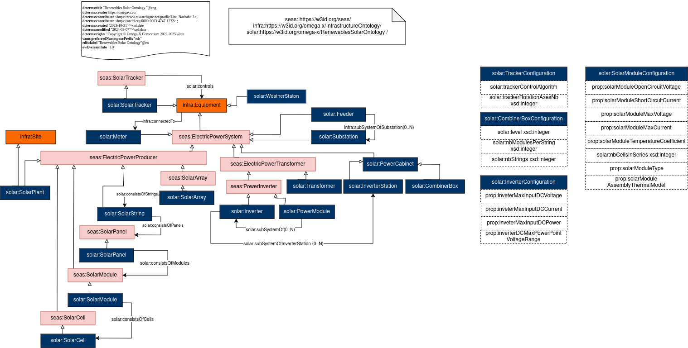

# Renewables Solar Ontology
## Description
### Purpose
Information about sharing data concerning solar plant in order to execute a set of services
### Scope
This module provides solar dedicated classes for the simplified topology as well as mechanism to attach dynamic measures to equipment.
## Competency Questions

### Querying Questions
| ID | Question in natural language | Example
|---|---|---|
|CQ1| What is the static configuration of each equipment ?| The configuration properties of an equipement |
|CQ2|For a given equipment what is the weatherStation to refer in order to have the irradiance time series ? | the weatherstation attached to the timeseries containing the irradiance  |
|CQ3|What are the equipments controlled by a tracker ? | The list of equipments controlled by a solar tracker |
|CQ4|What are the inverters of an inverter station ? | The list of inverter which are subsystem of an inverter station |

### Inference Questions
| ID | Question in natural language | Example
|---|---|---
|IQ1|What are the electric power production equipments of a solar site ? |The list of electric power production equipments such as solar array, solar string, solar panel, solar module and solar cells.
## Glossary
### Omega-X SOLAR
* [**solar:_SolarTracker_**](https://w3id.org/omega-x/EventTimeSeriesOntology/SolarTracker/)
A solar tracker is a device that orients a payload toward the Sun. Payloads are usually solar panels, parabolic troughs, fresnel reflectors, mirrors or lenses.
* [**solar:_SolarArray_**](https://w3id.org/omega-x/EventTimeSeriesOntology/SolarArray/)
Solar arrays consist of one or many strings of solar panels connected in parallel.
* [**solar:_SolarString_**](https://w3id.org/omega-x/EventTimeSeriesOntology/SolarString/)
Solar strings consist of one or many solar panels connected in series.
* [**solar:_SolarPanel_**](https://w3id.org/omega-x/EventTimeSeriesOntology/SolarPanel/)
Solar panels consist of one or many solar modules integrated in the same mechanical part.
* [**solar:_SolarModule_**](https://w3id.org/omega-x/EventTimeSeriesOntology/SolarModule/)
Solar modules consist of one or many solar cells in parallel to a by-pass diode.
* [**solar:_SolarCell_**](https://w3id.org/omega-x/EventTimeSeriesOntology/SolarCell/)
Device that directly converts the energy of light into electrical energy through the photovoltaic effect.
* [**solar:_Inverter_**](https://w3id.org/omega-x/EventTimeSeriesOntology/Inverter/)
The class of electronic devices or circuitry that change direct current (DC) to alternating current (AC).
* [**solar:_PowerModule_**](https://w3id.org/omega-x/EventTimeSeriesOntology/PowerModule/)
A sub unit of PowerInverter with valves for three phases, together with unit control equipment, essential protective and switching devices, DC storage capacitors, phase reactors and auxiliaries, if any, used for conversion.
* [**solar:_Transformer_**](https://w3id.org/omega-x/EventTimeSeriesOntology/Transformer/)
An electric power transformer is an electric power system that is capable of transforming electricity within a power network, between a primary connection point and a secondary connection point.
* [**solar:_InverterStation_**](https://w3id.org/omega-x/EventTimeSeriesOntology/InverterStation/)
Cabinet of inverters.
* [**solar:_CombinerBox_**](https://w3id.org/omega-x/EventTimeSeriesOntology/CombinerBox/)
PowerCabinet wich contain electrical equipments for combining energy coming from solar arrays.
* [**solar:_PowerCabinet_**](https://w3id.org/omega-x/EventTimeSeriesOntology/PowerCabinet/)
Cabinet for electrical equipments.
* [**solar:_Substation_**](https://w3id.org/omega-x/EventTimeSeriesOntology/Substation/)
A collection of equipment for purposes other than generation or utilization, through which electric energy in bulk is passed for the purposes of switching or modifying its characteristics. 
* [**solar:_Feeder_**](https://w3id.org/omega-x/EventTimeSeriesOntology/Feeder/)
A collection of equipment for organizational purposes, used for grouping distribution resources. The organization of a feeder does not necessarily reflect connectivity or current operation state.
* [**solar:_WeatherStation_**](https://w3id.org/omega-x/EventTimeSeriesOntology/WeatherStation/)
A weather station is instruments and equipment for measuring atmospheric conditions to provide information for weather forecasts and to study the weather and climate.(source : wikipedia).
* [**solar:_Meter_**](https://w3id.org/omega-x/EventTimeSeriesOntology/Meter/)
Equipment measuring the production of PV Plant.
## OWL Description

## Related Work
### SEAS
* [**_seas:_ElectricPowerSystem_**]( https://w3id.org/seas/ElectricPowerSystem): 
The class of evaluations for electric reactance properties.
* [**_seas:_ElectricPowerProducer_**]( https://w3id.org/seas/ElectricPowerProducer): An electric power producer is an electric power system that is capable of producing electricity.
* [**_seas:_ElectricPowerTransformer_**]( https://w3id.org/seas/ElectricPowerTransformer): 
An electric power transformer is an electric power system that is capable of transforming electricity within a power network, between a primary connection point and a secondary connection point.
* [**_seas:_SolarPanel_**]( https://w3id.org/seas/SolarPanel): 
Solar panels consist of one or many solar modules.
* [**_seas:_SolarModule_**]( https://w3id.org/seas/SolarModule): 
Solar modules consist of one or many solar cells.
* [**_seas:_SolarCell_**]( https://w3id.org/seas/SolarCell): 
Solar cells belong a solar module.
* [**_seas:_PowerInverter_**]( https://w3id.org/seas/PowerInverter): 
The class of electronic devices or circuitry that change direct current (DC) to alternating current (AC). (source: The Authoritative Dictionary of IEEE Standards Terms, Seventh Edition, IEEE Press, 2000, ISBN 0-7381-2601-2, page 588).
* [**_seas:_SolarTracker_**]( https://w3id.org/seas/SolarTracker): 
A solar tracker is a device that orients a payload toward the Sun. Payloads are usually solar panels, parabolic troughs, fresnel reflectors, mirrors or lenses. (source: Wikipedia).
* [**_seas:_connectedTo_**]( https://w3id.org/seas/connectedTo): 
Links a system to a system it is connected to.
* [**_seas:_subSystemOf_**]( https://w3id.org/seas/subSystemOf): 
Properties of subsystems somehow contribute to the properties of the super system
### PLATOON
* [**plt:_WeatherStation_**]( https://w3id.org/platoon/WeatherStation): 
A weather station is  instruments and equipment for measuring atmospheric conditions to provide information for weather forecasts and to study the weather and climate.(source : wikipedia).
### SAREF For System
* [**saref4syst:_System_**]( https://saref.etsi.org/saref4syst/System): 
The class of systems, i.e., systems virtually isolated from the environment, whose behaviour and interactions with the environment are modeled. Systems can be connected to other systems. Connected systems interact in some ways. Systems can also have subsystems. Properties of subsystems somehow contribute to the properties of the supersystem.
* [**saref4syst:_connectedTo_**]( https://saref.etsi.org/saref4syst/connectedTo): 
Links a system to a system it is connected to. Connected systems interact in some way. The exact meaning of "interact" is defined by sub properties of s4syst:connectedTo. Property s4syst:connectedTo is symmetric. This property can be qualified using class s4syst:Connection, which connects the two systems. If there is a connection between several systems, then one may infer these systems are pairwise connected.
* [**saref4syst:_subSystemOf_**]( https://saref.etsi.org/saref4syst/subSystemOf): 
Links a system to its super system. Properties of subsystems somehow contribute to the properties of the super system. The exact meaning of "contribute is defined by sub properties of s4syst:subSystemOf. Property s4syst:subSystemOf is transitive.

