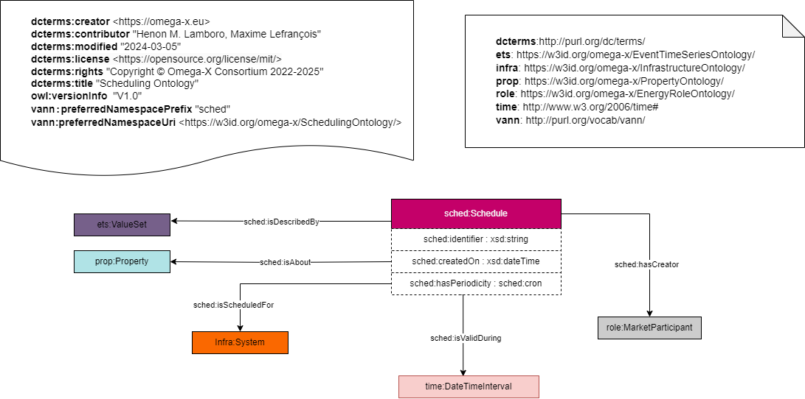

## Scheduling Ontology 

## Description
The scheduling ontology is a common ontology for all use cases. Its scope covers the definition of task, event or utilization timed schedules and list with optional assignments to actors. 

## Competency Questions
### Querying Questions
| ID | Question in natural language | Example
|---|---|---|
| cq-1 |What are the schedules that have been created?| List of schedules that have been created. |
| cq-2 |What are the schedules associated with market participants? | List of schedules created by a market participants. |
| cq-3 |What are the schedules that are valid during a given data interval? | List of schedules that are valid from "2024-04-29" to "2024-05-29".   |
| cq-4 |When was a schedule created?| A date in which a schedule was created on.|
## OWL Description

