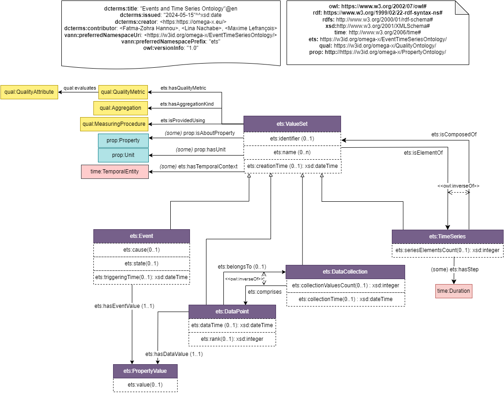

# Upper Level Ontology: Event & Time Series

## Description
`Events and Time Series`, or `ETS`, is the upper-level module of the Common Semantic Data Model (CSDM). It is an upper-level ontology that captures knowledge about datasets' global structure and underlying elements.
The scope of this module extends also to the definition of common metadata for shared datasets.

## Competency Questions
### Querying Questions
| ID | Question in natural language | Example
|---|---|---|
| cq-1 | What event occured within a specific time period ? | The list of events that has a temporal footprint within the indicated time period. |
| cq-2 | What is the type of time series elements ?   | Time series can be composed of events, data points, data collections or other time series. |
| cq-3 | Does a specific data set represent measured/observed phenomenon or predicted activity ? | Given a value set, what quality indictor are associated, covering measuring methodology ? Example: a time series about energy production can correspond to a prediction provided by a software.  |
| cq-4 | To what granularity correspond each element of the time series ? exact time instant observation or aggregatd values on an interval ?  | Given a time series, what quality indicators are associated covering the granularity level ? (max, min, avg,...). Example: electrical consumption time series can be provided with hourly average values.  |
| cq-5 | What are time series that describe multiple properties of weather data (temperature, pressure, irradiance,...) ? | Identify time series that describe meteo properties. |
| cq-6 | To what extent the dataset is temporally valid ? | what temporal context is associated with the value set ? Example: data about equipement quality state provided on a weekly basis, is considered valid the entire week.  |
### Inference Questions
| ID | Question in natural language | Example
|---|---|---|
| iq-1 | What are properties covered by a data collection ? | Properties covered by a data collection are the set of properties associated to data points belonging to this collection. |
| iq-2 | What is the temporal context of a time series  ? | The temporal context of a time series can be infered as the interval starting with the time associated to the first element, and ending with the time associated to the last element. |

## Glossary
### Omega-X ETS
* [**ets:_ValueSet_**](https://w3id.org/omega-x/EventTimeSeriesOntology/ValueSet/)
Value container for a set of data (data point, collection, event or time series).
* [**ets:_TimeSeries_**](https://w3id.org/omega-x/EventTimeSeriesOntology/TimeSeries/)
Value container for a time series.
* [**ets:_DataCollection_**](https://w3id.org/omega-x/EventTimeSeriesOntology/DataCollection/)
A data collection represents a set of data points, that share some common context. Data Collections can have a common dateTime.
* [**ets:_DataPoint_**](https://w3id.org/omega-x/EventTimeSeriesOntology/DataPoint/)
A data point with a unique value, and possible data time.
* [**ets:_Event_**](https://w3id.org/omega-x/EventTimeSeriesOntology/Event/)
An occurrence of a change in the environement that happens at a specific time.
* [**ets:_PropertyValue_**](https://w3id.org/omega-x/EventTimeSeriesOntology/PropertyValue/)
A property value is the value associated with a unique property and a unit of measurement.
## OWL Description

## Recommendations
- A `ets:ValueSet` is a generic concept that covers different structures of datasets. It is recommended to specify through sublcasses the exact type of the top class value set: `ets:DataPoint`, `ets:DataCollection`, `ets:Event`, `ets:TimeSeries`. A `ets:ValueSet` is identified using an identifier or a name. It might have a `ets:creationTime` corresponidng to the time instant when the data structure has been digitally created or uploaded into the dataspace for example. Real-world temporal footprint is indicated in subclasses. 

- A set of quality indicators can be associated to value sets. They are described in the `quality` module (`qual:Aggregation`, `qual:QualityMetric`, `qual:MeasuringProcedure`).

- Value Sets basic elements are `ets:DataPoint` and `ets:Event`. They both enable to indicate a mandatory value `ets:propertyValue` using an object property (resp. `ets:hasDataValue` and `ets:hasEventValue`). They also provide description on temporality. 

- A value set and property value provide descriptions about some properties `prop:Property` (see [_property_](../Property Ontology)). In case the entire `TimeSeries` describe one unique property, the information about the property (`prop:isAboutProperty`) is indicated at the global level (`TimeSeries`). Elsewhere, detailed description of properties described is associated with each `DataPoint` or `Event`.

- Data collections enable to devine a structured data container where data points are ordered using a `ets:rank` value (when temporal footprint is not used). 

- Time series elements has a mandatory temporal footprint (`dataTime`, `eventTime`, `collectionTime` or temporal context is case of nested time series). 

- One `PropertyValue` is defined for each `DataPoint` or `Event`. It can either describe a `QuantitativeProperty` using numerical values in `ets:value` or `prop:QualitativeProprety` by indicating as a range of `hasDataValue` (resp. `hasEventValue`) an individual of `Category` used to evaluate qualitative properties. In the latter case, no instanciation of property value is needed. 

- In case of dynamic datasets, `PropertyValue` is used to build complex data structure with multiple values for the same `Property`. `PropertyValue` also provides a way to indicate static values (stable in time) for `Property` such as the voltage of an equipement, or the color of a connection. 

## Related Work

### INTERCONNECT
* [**_ic-data:TimeSeries_**](http://ontology.tno.nl/interconnect/datapoint#TimeSeries): An ordered sequence of data points of a quantity observed at spaced time intervals is referred to as a time series. Time series can be a result of prediction algorithm.

* [**_ic-data:DataPoint_**](http://ontology.tno.nl/interconnect/datapoint#DataPoint): A data point is a quantity that is extended with various pieces of process information, namely : 
- A creation time (instant). This is the point in time when the data point was created, which is not necessarily the time for which it is valid. In the case of soft-sensors or forecasters, a data point might have been created ahead of time, in the case of a direcet measurement a data point might created at its time of validity (or at the end of its validity time interval) and in the case of an archived value the data point might have been created after the fact.

 - A validity time (temporal entity) which will be named \"time stamp\". The validity time is the instant or interval in time in which a specific quantity is in effect. For example a room temperature might be measured at 12:00, which means it is in effect at this very instant. A specific amount of energy might me expended within the time-slot between 12:30 and 12:45, which means that the energy measurement is in effect during this time interval.

 - A location or topological association. For example, a measurement might be taken in a specific room, a power avarage might have been measured by a specific meter, a forecast might be valid for a specific region or grid segment. This association is therefore not always a location.

### SEDMOON
* [**_plt:Event_**](https://w3id.org/platoon/Event): A event is a thing that happens. An event has a temporal context. 

* [**_plt:EnergyEvaluation_**](https://w3id.org/platoon/EnergyEvaluation): The class of evaluation for energy properties.

### Data Catalog Vocabulary (DCAT)
* [**_dcat:Dataset_**](https://www.w3.org/ns/dcat#dataset): A collection of data, published or curated by a single source, and available for access or download in one or more representations.

